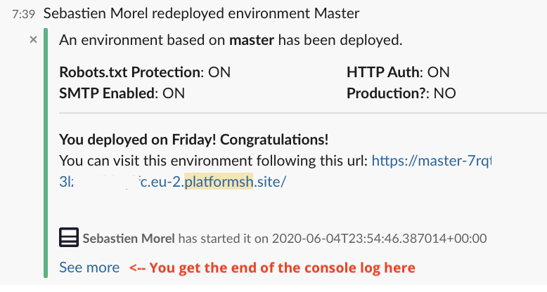
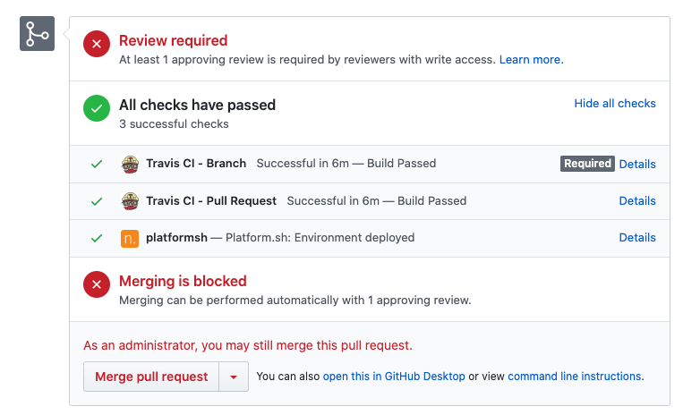

# Platform.sh Activity Scripts

This repository provides a set of Platform.sh activity scripts useful for any projects.

## Script list:

- **github/env_url.js**: creates a Github Status providing the first URL of a new deployed environnement
- **slack/deploy.js**: sends a rich message to a slack channel


## How to use the script

```
curl ${URLOFTHESCRIPT} --output script.js
platform integration:add --type script --file ./script.js --events event1,event2,event3
rm script.js
```


## Scripts

### slack/deploy.js

This script needs information about your Slack channel incomming Webhook, so you need to create a project variable on Platform.sh

```
https://hooks.slack.com/services/XXXXX/XXXXXX/XXXXX
```

The project variable MUST be `SLACK_URL` and should be set as sensitive. 

Then you can install it

```json
curl https://raw.githubusercontent.com/Plopix/platformsh-activity-scripts/master/slack/deploy.js --output script.js
platform integration:add --type script --file ./script.js --events environment.redeploy --states="complete"
rm script.js
```



### github/env_url.js

This script needs information about your GITHUB repository, so you need to create a project variable on Platform.sh

```json
{
    "owner": "YourLogin", 
    "repository": "YourRepo", 
    "token": "YourToken"    
}
```

The project variable MUST be `GITHUB_AUTH` and should be set as sensitive. 

Then you can install it

```json
curl https://raw.githubusercontent.com/Plopix/platformsh-activity-scripts/master/github/env_url.js --output script.js
platform integration:add --type script --file ./script.js --events environment.redeploy --states="complete"
rm script.js
```




## LICENCE


[MIT](LICENSE)
